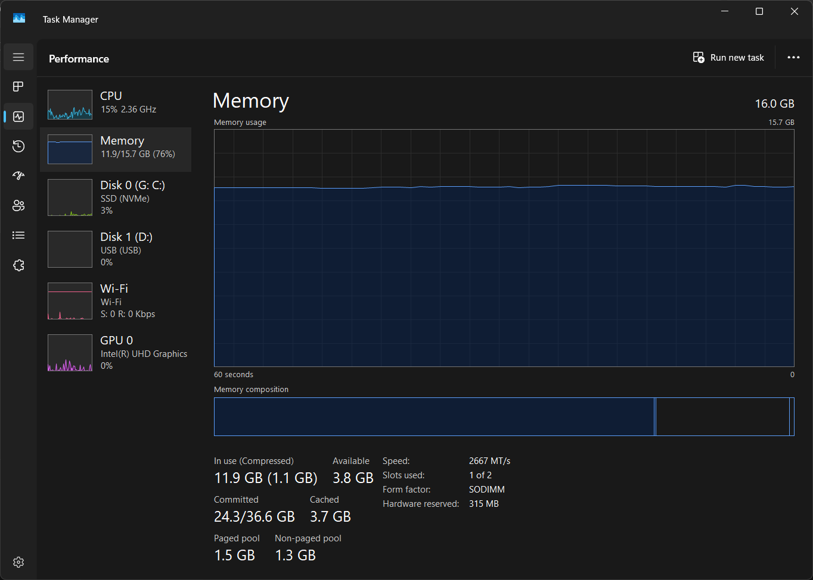

- Disk usage
- Anti-virus
- IO

I haven't used Linux in a while, but I remember when I did I would be **quite**
shocked at the low resource use while I was using my PC, coming from Windows. 

My ram usage is consistently closer to 100% even though my computer is not doing 
anything worthwhile.




I rarely ever use windows with a ram usage <60%

Maybe it's Docker and I forgot to drop some images.

```bash
docker ps
CONTAINER ID   IMAGE     COMMAND   CREATED   STATUS    PORTS     NAMES
# No images
```

But that's not it.


Most applications in windows run separate background processes, for updating,
telemetry and so on.


```bash
tasklist | findstr /i "Figma"

Figma.exe                    16716 Console                    1     37,980 K
Figma.exe                     1540 Console                    1      1,504 K
Figma.exe                    19380 Console                    1     11,912 K
Figma.exe                    15800 Console                    1     16,420 K
Figma.exe                     1464 Console                    1      2,364 K
Figma.exe                    26112 Console                    1     20,316 K
figma_agent.exe              22168 Console                    1      5,488 K
```

I consider myself a power user, but I still think these results apply to people in general.
